# Solution - TP14c : Visualisation d'architectures Docker Compose

## Exercice 1 : Installation et premier schéma

### Réponses aux questions

1. **Quels services dépendent de quel autre service ?**
   - `app` dépend de `db` (via `depends_on`)
   - `web` n'a pas de dépendances explicites

2. **Combien de réseaux sont créés ?**
   - 2 réseaux : `frontend` et `backend`
   - `app` est sur les deux réseaux (pont entre les couches)
   - `web` uniquement sur `frontend`
   - `db` uniquement sur `backend` (isolation)

3. **Quel service est accessible de l'extérieur ?**
   - Seulement `web` expose le port 8080 vers l'hôte
   - Les autres services ne sont accessibles que depuis l'intérieur du réseau Docker

### Commande simplifiée

```bash
# Alias pour faciliter l'utilisation
alias dcviz='docker run --rm -it -v $(pwd):/input pmsipilot/docker-compose-viz'

# Utilisation
dcviz render -m image docker-compose-simple.yml --output-file=/input/diagram.png --force
```

---

## Exercice 2 : Stack WordPress

### Réponses aux questions

1. **Identifiez les dépendances entre services**

Hiérarchie de démarrage :
```
db (démarre en premier)
  ↓ (depends_on avec condition healthy)
wordpress
  ↓ (depends_on simple)
phpmyadmin
```

Le diagramme montre clairement :
- Flèche de `wordpress` vers `db` avec label "service_healthy"
- Flèche de `phpmyadmin` vers `db` sans condition

2. **Quel service utilise des healthchecks ?**

Seulement `db` (MySQL) a un healthcheck :
```yaml
healthcheck:
  test: ["CMD", "mysqladmin", "ping", "-h", "localhost"]
  interval: 10s
  timeout: 5s
  retries: 5
  start_period: 30s
```

Cela garantit que WordPress ne démarre pas avant que MySQL soit réellement prêt à accepter des connexions.

3. **Quels sont les volumes persistants ?**

Deux volumes nommés :
- `wordpress_data` → `/var/www/html` (fichiers WordPress + uploads)
- `db_data` → `/var/lib/mysql` (données MySQL)

Ces volumes persistent même si les conteneurs sont supprimés.

4. **Tous les services sont-ils sur le même réseau ?**

Oui, tous sur `wp_network`. Dans ce cas simple, l'isolation n'est pas critique.

Pour améliorer la sécurité en production :
```yaml
networks:
  frontend:  # nginx + wordpress
  backend:   # wordpress + db (db pas exposé au frontend)
```

### Analyse du diagramme

Le diagramme SVG vs PNG :
- **SVG** : Redimensionnable sans perte, parfait pour la doc web
- **PNG** : Meilleur pour intégration dans PDF ou présentations
- **DOT** : Permet personnalisation avec Graphviz

### Format DOT personnalisé

```bash
# Générer le DOT
dcviz render wordpress-stack.yml --output-file=/input/wordpress.dot --force

# Personnaliser avec Graphviz
dot -Tpng \
    -Gdpi=300 \
    -Gbgcolor=transparent \
    -Nfontname="Arial" \
    -Nstyle=filled \
    -Nfillcolor="#E8F4F8" \
    wordpress.dot -o wordpress-custom.png
```

---

## Exercice 3 : Stack de monitoring

### Réponses aux questions

1. **Combien de services exportent des métriques ?**

4 services exportent des métriques :
- `node-exporter` → métriques système (CPU, RAM, disque) sur port 9100
- `cadvisor` → métriques conteneurs Docker sur port 8080
- `prometheus` → métriques de Prometheus lui-même sur port 9090
- Potentiellement votre application si elle expose `/metrics`

2. **Quel service centralise les métriques ?**

`prometheus` :
- Scrape (récupère) les métriques des exporters toutes les 15s
- Stocke les time-series dans `/prometheus` (volume persistant)
- Expose une API pour les requêtes (utilisée par Grafana)

3. **Quel service gère les alertes ?**

`alertmanager` :
- Reçoit les alertes de Prometheus
- Gère la déduplication et le grouping
- Route vers les bonnes destinations (email, Slack, PagerDuty, etc.)

4. **Identifiez le flux de données**

```
┌─────────────────┐
│ node-exporter   │──┐
│ cadvisor        │──┤
│ (votre app)     │──┤  HTTP scrape
└─────────────────┘  │  (pull model)
                     │
                     ▼
              ┌─────────────┐
              │ Prometheus  │
              │ (stockage)  │
              └──────┬──────┘
                     │
        ┌────────────┴────────────┐
        │                         │
        ▼                         ▼
   ┌─────────┐            ┌──────────────┐
   │ Grafana │            │ AlertManager │
   │ (UI)    │            │ (alertes)    │
   └─────────┘            └──────────────┘
```

### Analyse des différents formats

**Horizontal (`--horizontal`)** :
- Meilleur pour stacks avec beaucoup de services au même niveau
- Évite un diagramme trop haut
- Idéal pour monitoring, microservices

**Sans volumes (`--no-volumes`)** :
- Simplifie pour focus sur les dépendances entre services
- Utile pour diagrammes de présentation
- Moins de "bruit visuel"

**Sans réseaux (`--no-networks`)** :
- Encore plus simple
- Seulement services et leurs dépendances
- Parfait pour comprendre l'ordre de démarrage

### Cas d'usage par format

```bash
# Documentation technique complète
dcviz render -m image monitoring-stack.yml \
  --output-file=/input/docs/architecture-complete.png \
  --force

# Présentation exécutive (simple)
dcviz render -m image monitoring-stack.yml \
  --output-file=/input/slides/monitoring-overview.png \
  --no-volumes --no-networks --horizontal \
  --force

# Debugging réseau
dcviz render -m image monitoring-stack.yml \
  --output-file=/input/debug/network-topology.png \
  --no-volumes \
  --force
```

---

## Exercice 4 : Stack application complète

### Réponses aux questions

1. **Identifiez les différentes couches**

**Frontend** (accès public) :
- `nginx` : Reverse proxy, TLS termination, serveur statique

**Backend** (logique métier) :
- `api` : REST API (Node.js)
- `worker` : Jobs asynchrones (3 réplicas)

**Data** (persistance) :
- `postgres` : Base de données principale
- `elasticsearch` : Moteur de recherche (produits, etc.)

**Cache** (performance) :
- `redis` : Sessions, cache applicatif

**Queue** (async processing) :
- `rabbitmq` : File de messages pour workers

2. **Quel service agit comme point d'entrée unique ?**

`nginx` :
- Seul service exposant des ports publics (80, 443)
- Fait office de reverse proxy vers `api`
- Sert les fichiers statiques (JS, CSS, images du frontend)
- Peut gérer TLS, rate limiting, etc.

Pattern "API Gateway" :
```
User → Nginx → API → Services backend
```

3. **Quels services peuvent scaler horizontalement ?**

Facilement scalables (stateless) :
- ✅ `api` : Sans session locale (utilise Redis)
- ✅ `worker` : Déjà configuré avec `replicas: 3`
- ✅ `nginx` : Via load balancer externe

Ne peuvent PAS scaler facilement (stateful) :
- ❌ `postgres` : Nécessite réplication/sharding complexe
- ❌ `redis` : Nécessite Redis Cluster ou Sentinel
- ❌ `rabbitmq` : Nécessite clustering
- ❌ `elasticsearch` : Fonctionne en cluster mais config spécifique

Pour scaler les APIs :
```bash
docker compose up -d --scale api=5 --scale worker=10
```

Mais nécessite :
- Retirer `ports:` de la définition du service `api`
- Utiliser `nginx` comme load balancer
- Configurer nginx upstream :

```nginx
upstream api_backend {
    least_conn;
    server api:3000;  # Docker DNS fait le round-robin
}
```

4. **Identifiez les services de stockage persistant**

4 volumes pour la persistance :
```yaml
volumes:
  postgres_data:       # Données SQL
  redis_data:          # Snapshots Redis (AOF)
  rabbitmq_data:       # Messages persistants
  elasticsearch_data:  # Index de recherche
```

**CRITIQUE pour production** :
- Backups réguliers de `postgres_data`
- Réplication de `postgres` et `elasticsearch`
- `redis_data` peut être régénérable (cache)

5. **Quels réseaux isolent quels services ? Pourquoi ?**

4 réseaux pour isolation de sécurité :

```yaml
frontend:
  - nginx (public)
  - api (backend)

backend:
  - api
  - worker
  - postgres
  - elasticsearch

cache:
  - api
  - redis

queue:
  - api
  - worker
  - rabbitmq
```

**Principes de sécurité** :

1. **Postgres inaccessible depuis nginx** :
   - Pas sur `frontend`
   - Évite injection SQL directe

2. **Redis isolé** :
   - Seulement `api` y accède
   - Pas de cache poisoning depuis workers

3. **RabbitMQ partagé** :
   - `api` envoie jobs
   - `worker` consomme jobs
   - Mais pas d'accès direct à la DB pour les workers via queue

**Améliorations possibles** :

```yaml
# Workers n'ont pas besoin de Redis
queue:
  - api (producer)
  - worker (consumer)
  - rabbitmq

# Workers accèdent directement à Postgres
backend:
  - worker
  - postgres
```

### Script d'analyse

```bash
#!/bin/bash
# analyze-architecture.sh

COMPOSE_FILE="$1"

echo "=== Analyse de $COMPOSE_FILE ==="
echo ""

echo "Services par réseau :"
docker compose -f $COMPOSE_FILE config | \
  yq eval '.services | to_entries | .[] | .key + ": " + (.value.networks | keys | join(", "))' -

echo ""
echo "Volumes persistants :"
docker compose -f $COMPOSE_FILE config | \
  yq eval '.volumes | keys | .[]' -

echo ""
echo "Ports exposés :"
docker compose -f $COMPOSE_FILE config | \
  yq eval '.services | to_entries | .[] | select(.value.ports) | .key + ": " + (.value.ports | join(", "))' -

echo ""
echo "Services avec healthcheck :"
docker compose -f $COMPOSE_FILE config | \
  yq eval '.services | to_entries | .[] | select(.value.healthcheck) | .key' -

echo ""
echo "Dépendances :"
docker compose -f $COMPOSE_FILE config | \
  yq eval '.services | to_entries | .[] | select(.value.depends_on) | .key + " depends on: " + (.value.depends_on | keys | join(", "))' -
```

---

## Exercice 5 : Intégration dans la documentation

### Makefile expliqué

```makefile
# Trouve tous les fichiers .yml dans le répertoire courant
COMPOSE_FILES := $(wildcard *.yml)

# Transforme chaque .yml en .png dans docs/diagrams/
# Exemple: wordpress-stack.yml → docs/diagrams/wordpress-stack.png
DIAGRAMS := $(patsubst %.yml,$(DIAGRAMS_DIR)/%.png,$(COMPOSE_FILES))

# Crée une dépendance : si le .yml change, régénère le .png
$(DIAGRAMS_DIR)/%.png: %.yml
    @docker run --rm \
        -v $(CURDIR):/input \
        pmsipilot/docker-compose-viz \
        render -m image $< \
        --output-file=/input/$@ \
        --force
```

**Usage avancé** :

```bash
# Générer seulement les diagrammes modifiés
make diagrams

# Forcer la régénération de tout
make clean && make diagrams

# Générer un seul fichier
make docs/diagrams/wordpress-stack.png

# Voir ce qui serait généré sans le faire
make -n diagrams
```

### Documentation automatique améliorée

**Script avec métadonnées** :

```bash
#!/bin/bash
# generate-docs-advanced.sh

generate_diagram_with_metadata() {
    local compose_file=$1
    local output_base="${compose_file%.yml}"

    # Générer le diagramme
    docker run --rm \
        -v $(pwd):/input \
        pmsipilot/docker-compose-viz \
        render -m image "$compose_file" \
        --output-file="/input/docs/diagrams/${output_base}.png" \
        --force

    # Extraire métadonnées
    local num_services=$(yq eval '.services | length' "$compose_file")
    local num_volumes=$(yq eval '.volumes | length' "$compose_file")
    local num_networks=$(yq eval '.networks | length' "$compose_file")

    # Générer section Markdown
    cat <<EOF

## $(basename $output_base | sed 's/-/ /g' | sed 's/\b\(.\)/\u\1/g')


**Statistiques :**
- Services : $num_services
- Volumes : $num_volumes
- Réseaux : $num_networks
- Dernière mise à jour : $(date '+%Y-%m-%d %H:%M:%S')

### Services

$(yq eval '.services | to_entries | .[] | "- **" + .key + "**: " + .value.image' "$compose_file")

### Ports exposés

$(yq eval '.services | to_entries | .[] | select(.value.ports) | "- **" + .key + "**: " + (.value.ports | join(", "))' "$compose_file")

EOF
}

# Générer pour tous les fichiers
for file in *-stack.yml; do
    [ -f "$file" ] && generate_diagram_with_metadata "$file"
done
```

---

## Exercice 6 : Options avancées

### Personnalisation Graphviz

**Exemples de customisation du fichier DOT** :

```dot
digraph G {
    # Fond transparent pour intégration web
    bgcolor="transparent";

    # Style des nœuds
    node [
        shape=box,
        style="rounded,filled",
        fillcolor="#E8F4F8",
        fontname="Helvetica",
        fontsize=12
    ];

    # Style des arêtes (flèches)
    edge [
        color="#333333",
        fontname="Helvetica",
        fontsize=10
    ];

    # Services par couleur selon le rôle
    nginx [fillcolor="#90EE90" label="nginx\n(proxy)"];
    api [fillcolor="#87CEEB" label="API\n(Node.js)"];
    postgres [fillcolor="#FFB6C1" label="PostgreSQL\n(database)"];
    redis [fillcolor="#FFE4B5" label="Redis\n(cache)"];

    # Flèches avec labels
    nginx -> api [label="proxy_pass"];
    api -> postgres [label="SQL"];
    api -> redis [label="GET/SET"];
}
```



**Générer avec style personnalisé** :

```bash
dot -Tpng \
    -Gdpi=150 \
    -Grankdir=LR \
    -Nshape=record \
    custom.dot -o styled-diagram.png
```

### Layouts comparés

**dot (hiérarchique)** :
- Bon pour : Applications en couches (frontend → backend → data)
- Direction : Top → Bottom par défaut

**circo (circulaire)** :
- Bon pour : Microservices avec beaucoup d'interconnexions
- Centre : Service principal (API gateway)

**neato (force-directed)** :
- Bon pour : Visualiser la "complexité" d'une architecture
- Plus les services sont connectés, plus ils sont proches

**twopi (radial)** :
- Bon pour : Architecture hub-and-spoke
- Centre : Hub (ex: message broker)
- Périphérie : Services

**Exemple comparatif** :

```bash
for layout in dot circo neato twopi fdp; do
    $layout -Tpng ecommerce-stack.dot -o "layout-$layout.png"
done

# Créer une comparaison
convert layout-*.png -append comparison-all-layouts.png
```

---

## Exercice 7 : CI/CD Integration

### GitHub Actions - Points clés

1. **Déclenché seulement sur changements pertinents** :
```yaml
on:
  push:
    paths:
      - '**/*.yml'
      - '**/*.yaml'
```

2. **Commit automatique avec [skip ci]** :
```bash
git commit -m "docs: update diagrams [skip ci]"
```
Évite une boucle infinie (commit → CI → commit → CI...)

3. **Permissions nécessaires** :
```yaml
permissions:
  contents: write  # Pour push les changements
```

### GitLab CI - Améliorations

**Cache des images Docker** :

```yaml
generate-diagrams:
  stage: documentation
  image: docker:latest
  services:
    - docker:dind
  cache:
    key: docker-compose-viz
    paths:
      - .docker-cache/
  before_script:
    - docker load -i .docker-cache/dcviz.tar || true
  script:
    - # ... génération ...
    - docker save pmsipilot/docker-compose-viz -o .docker-cache/dcviz.tar
```

**Notifications** :

```yaml
  after_script:
    - |
      if [ $CI_JOB_STATUS == 'success' ]; then
        curl -X POST $SLACK_WEBHOOK \
          -d '{"text":"Architecture diagrams updated for '"$CI_COMMIT_REF_NAME"'"}'
      fi
```

### Pre-commit Hook

**`.git/hooks/pre-commit`** :

```bash
#!/bin/bash

# Vérifier si des docker-compose.yml ont changé
changed_files=$(git diff --cached --name-only --diff-filter=ACM | grep 'docker-compose.*\.yml$')

if [ -n "$changed_files" ]; then
    echo "Docker Compose files changed, regenerating diagrams..."

    for file in $changed_files; do
        output="docs/diagrams/$(basename ${file%.yml}).png"
        docker run --rm \
            -v $(pwd):/input \
            pmsipilot/docker-compose-viz \
            render -m image "$file" \
            --output-file="/input/$output" \
            --force

        # Ajouter le diagramme au commit
        git add "$output"
    done

    echo "Diagrams updated and staged."
fi
```

---

## Exercice 8 : Comparaison de versions

### Script amélioré

```bash
#!/bin/bash
# compare-architecture.sh

set -e

COMPOSE_FILE="$1"
OLD_COMMIT="${2:-HEAD~1}"
NEW_COMMIT="${3:-HEAD}"

if [ -z "$COMPOSE_FILE" ]; then
    echo "Usage: $0 <compose-file> [old-commit] [new-commit]"
    exit 1
fi

TEMP_DIR=$(mktemp -d)
trap "rm -rf $TEMP_DIR" EXIT

mkdir -p "$TEMP_DIR/old" "$TEMP_DIR/new"

# Fonction pour générer diagramme + stats
generate_analysis() {
    local commit=$1
    local dir=$2

    # Extraire le fichier
    git show "$commit:$COMPOSE_FILE" > "$dir/docker-compose.yml" 2>/dev/null || return 1

    # Générer le diagramme
    docker run --rm \
        -v "$dir":/input \
        pmsipilot/docker-compose-viz \
        render -m image docker-compose.yml \
        --output-file=/input/diagram.png \
        --force

    # Extraire les stats
    {
        echo "Commit: $commit"
        echo "Services: $(yq eval '.services | length' "$dir/docker-compose.yml")"
        echo "Volumes: $(yq eval '.volumes | length' "$dir/docker-compose.yml")"
        echo "Networks: $(yq eval '.networks | length' "$dir/docker-compose.yml")"
        echo ""
        echo "Service list:"
        yq eval '.services | keys | .[]' "$dir/docker-compose.yml" | sed 's/^/  - /'
    } > "$dir/stats.txt"

    return 0
}

# Générer pour les deux versions
echo "Analyzing old version ($OLD_COMMIT)..."
if ! generate_analysis "$OLD_COMMIT" "$TEMP_DIR/old"; then
    echo "❌ File didn't exist at $OLD_COMMIT"
    OLD_EXISTS=false
else
    OLD_EXISTS=true
fi

echo "Analyzing new version ($NEW_COMMIT)..."
if ! generate_analysis "$NEW_COMMIT" "$TEMP_DIR/new"; then
    echo "❌ File doesn't exist at $NEW_COMMIT"
    NEW_EXISTS=false
else
    NEW_EXISTS=true
fi

# Afficher la comparaison
echo ""
echo "=== COMPARISON ==="
echo ""

if [ "$OLD_EXISTS" = true ]; then
    echo "OLD VERSION ($OLD_COMMIT):"
    cat "$TEMP_DIR/old/stats.txt"
    echo ""
fi

if [ "$NEW_EXISTS" = true ]; then
    echo "NEW VERSION ($NEW_COMMIT):"
    cat "$TEMP_DIR/new/stats.txt"
    echo ""
fi

# Diff des services
if [ "$OLD_EXISTS" = true ] && [ "$NEW_EXISTS" = true ]; then
    echo "=== CHANGES ==="
    echo ""

    # Services ajoutés
    ADDED=$(comm -13 \
        <(yq eval '.services | keys | .[]' "$TEMP_DIR/old/docker-compose.yml" | sort) \
        <(yq eval '.services | keys | .[]' "$TEMP_DIR/new/docker-compose.yml" | sort))

    if [ -n "$ADDED" ]; then
        echo "✅ Services added:"
        echo "$ADDED" | sed 's/^/  + /'
        echo ""
    fi

    # Services supprimés
    REMOVED=$(comm -23 \
        <(yq eval '.services | keys | .[]' "$TEMP_DIR/old/docker-compose.yml" | sort) \
        <(yq eval '.services | keys | .[]' "$TEMP_DIR/new/docker-compose.yml" | sort))

    if [ -n "$REMOVED" ]; then
        echo "❌ Services removed:"
        echo "$REMOVED" | sed 's/^/  - /'
        echo ""
    fi

    # Créer comparaison visuelle
    if command -v convert &> /dev/null; then
        convert \
            \( "$TEMP_DIR/old/diagram.png" -resize 800x -background white -gravity center -extent 800x600 \) \
            \( "$TEMP_DIR/new/diagram.png" -resize 800x -background white -gravity center -extent 800x600 \) \
            +append "$TEMP_DIR/comparison.png"

        # Ajouter labels
        convert "$TEMP_DIR/comparison.png" \
            -gravity North -pointsize 20 -annotate +0+10 "OLD ($OLD_COMMIT) vs NEW ($NEW_COMMIT)" \
            "$TEMP_DIR/comparison-labeled.png"

        echo "Visual comparison saved to:"
        echo "  $TEMP_DIR/comparison-labeled.png"
    fi
fi

echo ""
echo "Diagrams saved in: $TEMP_DIR"
ls -lh "$TEMP_DIR"/*/diagram.png 2>/dev/null || true
```

### Usage dans une PR

**GitHub PR comment script** :

```bash
#!/bin/bash
# .github/scripts/comment-architecture-changes.sh

BASE_SHA="${1:-origin/main}"
HEAD_SHA="${2:-HEAD}"

COMPOSE_FILES=$(git diff --name-only "$BASE_SHA" "$HEAD_SHA" | grep 'docker-compose.*\.yml$')

if [ -z "$COMPOSE_FILES" ]; then
    echo "No docker-compose files changed."
    exit 0
fi

COMMENT="## 🏗️ Architecture Changes\n\n"

for file in $COMPOSE_FILES; do
    ./compare-architecture.sh "$file" "$BASE_SHA" "$HEAD_SHA" > /tmp/comparison.txt

    COMMENT+="### \`$file\`\n\n"
    COMMENT+="\`\`\`\n$(cat /tmp/comparison.txt)\n\`\`\`\n\n"

    # Upload image to GitHub
    IMAGE_URL=$(gh pr upload-asset /tmp/comparison-labeled.png)
    COMMENT+="\n\n"
done

# Post comment
gh pr comment --body "$COMMENT"
```

---

## Bonnes pratiques - Récapitulatif

### 1. Automatisation complète

```yaml
# Workflow complet
.github/workflows/architecture.yml:
  - Générer diagrammes sur chaque commit
  - Comparer avec version précédente
  - Commenter la PR avec les changements
  - Publier dans GitHub Pages
```

### 2. Documentation vivante

```markdown
# docs/ARCHITECTURE.md
- Diagrammes auto-générés
- Date de dernière mise à jour
- Liens vers les fichiers source
- Statistiques (nombre de services, etc.)
```

### 3. Revue d'architecture

Checklist pour PR :
- [ ] Diagramme mis à jour
- [ ] Nouveaux services documentés
- [ ] Justification des changements d'architecture
- [ ] Impact sur les performances évalué
- [ ] Impact sur la sécurité évalué

### 4. Versionnement sémantique pour l'architecture

```bash
# Tag avec le diagramme de cette version
git tag -a v2.0.0 -m "Major architecture update: migrated to microservices"

# Extraire le diagramme d'une version spécifique
./compare-architecture.sh docker-compose.yml v1.0.0 v2.0.0
```

---

## Métriques d'architecture

### Script d'analyse de complexité

```bash
#!/bin/bash
# architecture-metrics.sh

analyze_complexity() {
    local file=$1

    echo "=== Architecture Complexity Metrics ==="
    echo ""

    # Nombre de services
    local num_services=$(yq eval '.services | length' "$file")
    echo "Services: $num_services"

    # Nombre de dépendances
    local num_deps=$(yq eval '[.services[] | select(.depends_on) | .depends_on | length] | add' "$file")
    echo "Total dependencies: ${num_deps:-0}"

    # Dépendances moyennes par service
    if [ $num_services -gt 0 ]; then
        echo "Avg dependencies per service: $(echo "scale=2; ${num_deps:-0} / $num_services" | bc)"
    fi

    # Services sans dépendances (feuilles)
    local leaf_services=$(yq eval '[.services | to_entries | .[] | select(.value.depends_on | not) | .key] | length' "$file")
    echo "Leaf services (no dependencies): $leaf_services"

    # Services critiques (beaucoup de dépendants)
    echo ""
    echo "Most depended-on services:"
    yq eval '.services | to_entries | map(.value.depends_on // {} | keys | .[]) | group_by(.) | map({service: .[0], count: length}) | sort_by(.count) | reverse | .[0:5]' "$file"

    # Nombre de ports exposés
    local exposed_ports=$(yq eval '[.services[] | select(.ports) | .ports | length] | add' "$file")
    echo ""
    echo "Exposed ports: ${exposed_ports:-0}"

    # Score de complexité (formule simple)
    local complexity=$((num_services * 10 + ${num_deps:-0} * 5 + ${exposed_ports:-0} * 2))
    echo ""
    echo "Complexity score: $complexity"

    if [ $complexity -lt 50 ]; then
        echo "  → Simple architecture ✅"
    elif [ $complexity -lt 150 ]; then
        echo "  → Moderate complexity ⚠️"
    else
        echo "  → Complex architecture 🚨 (consider splitting)"
    fi
}

analyze_complexity "$1"
```

### Suivi dans le temps

```bash
# Historique de la complexité
git log --oneline --all -- docker-compose.yml | while read commit msg; do
    complexity=$(git show $commit:docker-compose.yml 2>/dev/null | \
        yq eval '.services | length' - 2>/dev/null || echo 0)
    echo "$commit,$complexity"
done > complexity-history.csv

# Générer un graphique (nécessite gnuplot)
gnuplot <<EOF
set terminal png size 800,600
set output 'complexity-over-time.png'
set datafile separator ","
set xlabel "Commits"
set ylabel "Number of Services"
set title "Architecture Complexity Evolution"
plot 'complexity-history.csv' using 2 with lines title 'Services'
EOF
```

---

## Points clés à retenir

✅ **Automatisation** :
- Diagrammes générés automatiquement en CI/CD
- Pas de documentation manuelle à maintenir
- Toujours synchronisés avec le code

✅ **Formats multiples** :
- PNG pour documentation standard
- SVG pour web et redimensionnement
- DOT pour personnalisation avancée
- PDF pour distribution

✅ **Intégration** :
- GitHub/GitLab CI pour régénération auto
- Pre-commit hooks pour validation locale
- PR comments pour review d'architecture

✅ **Comparaison** :
- Diff visuel entre versions
- Métriques de complexité
- Identification des changements critiques

✅ **Documentation** :
- README avec diagrammes à jour
- Statistiques auto-générées
- Liens vers fichiers source

---

## Ressources complémentaires

**Outils similaires** :
- [compose-plantuml](https://github.com/funkwerk/compose-plantuml) - Génère PlantUML
- [docker-compose-graph](https://github.com/Alexis-benoist/docker-compose-graph) - Alternative en Python
- [compose-flow](https://github.com/openware/compose-flow) - Visualisation interactive

**Graphviz avancé** :
- [Graphviz Cookbook](https://graphs.grevian.org/)
- [Node, Edge and Graph Attributes](https://graphviz.org/doc/info/attrs.html)

**Architecture documentation** :
- [Arc42 Template](https://arc42.org/)
- [C4 Model](https://c4model.com/)
- [Architecture Decision Records](https://adr.github.io/)

---

**[← Retour au TP14c](../tp/TP14c-Docker-Compose-Visualisation.md)**
