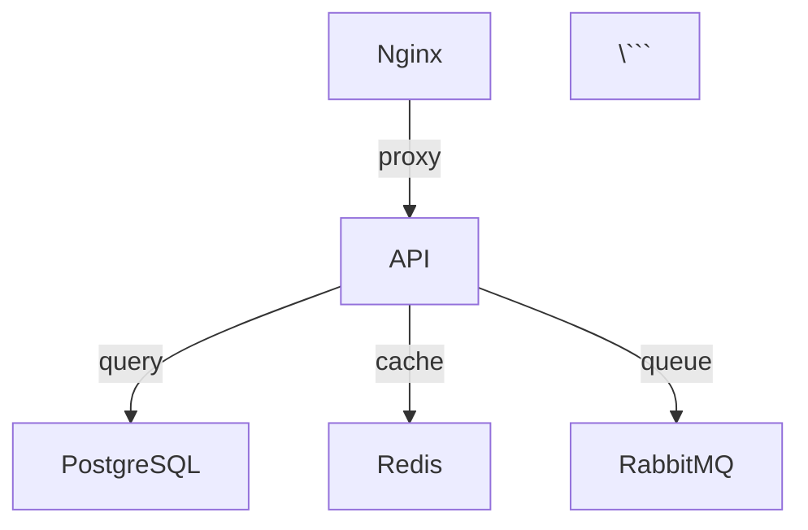

# TP14c - Visualisation d'architectures Docker Compose

## Objectifs pédagogiques

- Utiliser docker-compose-viz pour générer des schémas d'architecture
- Visualiser les dépendances entre services
- Documenter automatiquement vos stacks Docker Compose
- Comprendre la structure de vos applications multi-conteneurs

## Durée estimée

1 heure

---

## Introduction

La documentation d'architecture est essentielle, mais fastidieuse à maintenir manuellement. **docker-compose-viz** génère automatiquement des diagrammes à partir de vos fichiers `docker-compose.yml`, montrant :

- Les services et leurs images
- Les dépendances entre services
- Les volumes et leur utilisation
- Les réseaux et leur isolation
- Les ports exposés

## Prérequis

- Docker installé
- Quelques fichiers docker-compose.yml à visualiser

---

## Exercice 1 : Installation et premier schéma

### 1.1 - Test avec docker-compose-viz

docker-compose-viz est disponible en image Docker, pas besoin d'installation locale.

**Créez un répertoire de travail :**

```bash
mkdir -p ~/tp14c-visualization
cd ~/tp14c-visualization
```

### 1.2 - Premier exemple simple

**Créez un fichier `docker-compose-simple.yml` :**

```yaml
version: '3.8'

services:
  web:
    image: nginx:alpine
    ports:
      - "8080:80"
    volumes:
      - web_data:/usr/share/nginx/html
    networks:
      - frontend

  app:
    image: node:18-alpine
    depends_on:
      - db
    networks:
      - frontend
      - backend
    environment:
      - DB_HOST=db

  db:
    image: postgres:15-alpine
    volumes:
      - db_data:/var/lib/postgresql/data
    networks:
      - backend
    environment:
      - POSTGRES_PASSWORD=secret

volumes:
  web_data:
  db_data:

networks:
  frontend:
  backend:
```

**Générez le schéma :**

```bash
docker run --rm -it \
  --name dcv \
  -v $(pwd):/input \
  pmsipilot/docker-compose-viz \
  render -m image docker-compose-simple.yml \
  --output-file=/input/simple-diagram.png \
  --force
```

**Visualisez le résultat :**

```bash
# Sous Linux avec GUI
xdg-open simple-diagram.png

# Ou copiez le fichier vers votre machine locale
# scp user@server:~/tp14c-visualization/simple-diagram.png .
```

**Questions :**
1. Quels services dépendent de quel autre service ?
2. Combien de réseaux sont créés ?
3. Quel service est accessible de l'extérieur ?

---

## Exercice 2 : Stack WordPress (TP11)

Recréons la stack WordPress du TP11 et visualisons son architecture.

### 2.1 - Créer la stack WordPress

**Créez `wordpress-stack.yml` :**

```yaml
version: '3.8'

services:
  wordpress:
    image: wordpress:latest
    ports:
      - "8080:80"
    environment:
      WORDPRESS_DB_HOST: db
      WORDPRESS_DB_USER: wordpress
      WORDPRESS_DB_PASSWORD: wordpress_pass
      WORDPRESS_DB_NAME: wordpress
    volumes:
      - wordpress_data:/var/www/html
    depends_on:
      db:
        condition: service_healthy
    networks:
      - wp_network
    restart: unless-stopped

  db:
    image: mysql:8.0
    environment:
      MYSQL_DATABASE: wordpress
      MYSQL_USER: wordpress
      MYSQL_PASSWORD: wordpress_pass
      MYSQL_ROOT_PASSWORD: root_secret
    volumes:
      - db_data:/var/lib/mysql
    networks:
      - wp_network
    healthcheck:
      test: ["CMD", "mysqladmin", "ping", "-h", "localhost"]
      interval: 10s
      timeout: 5s
      retries: 5
      start_period: 30s
    restart: unless-stopped

  phpmyadmin:
    image: phpmyadmin:latest
    ports:
      - "8081:80"
    environment:
      PMA_HOST: db
      PMA_USER: wordpress
      PMA_PASSWORD: wordpress_pass
    depends_on:
      - db
    networks:
      - wp_network
    restart: unless-stopped

volumes:
  wordpress_data:
  db_data:

networks:
  wp_network:
    driver: bridge
```

### 2.2 - Générer le schéma

**Format PNG (par défaut) :**

```bash
docker run --rm -it \
  -v $(pwd):/input \
  pmsipilot/docker-compose-viz \
  render -m image wordpress-stack.yml \
  --output-file=/input/wordpress-diagram.png \
  --force
```

**Format SVG (vectoriel, redimensionnable) :**

```bash
docker run --rm -it \
  -v $(pwd):/input \
  pmsipilot/docker-compose-viz \
  render -m image wordpress-stack.yml \
  --output-file=/input/wordpress-diagram.svg \
  --force
```

**Format DOT (pour personnalisation avec Graphviz) :**

```bash
docker run --rm -it \
  -v $(pwd):/input \
  pmsipilot/docker-compose-viz \
  render wordpress-stack.yml \
  --output-file=/input/wordpress-diagram.dot \
  --force
```

### 2.3 - Analyse du schéma

**Questions :**
1. Identifiez les dépendances entre services
2. Quel service utilise des healthchecks ?
3. Quels sont les volumes persistants ?
4. Tous les services sont-ils sur le même réseau ?

---

## Exercice 3 : Stack de monitoring (TP12)

Créons une stack de monitoring plus complexe.

### 3.1 - Stack Prometheus + Grafana

**Créez `monitoring-stack.yml` :**

```yaml
version: '3.8'

services:
  prometheus:
    image: prom/prometheus:latest
    ports:
      - "9090:9090"
    volumes:
      - ./prometheus.yml:/etc/prometheus/prometheus.yml
      - prometheus_data:/prometheus
    command:
      - '--config.file=/etc/prometheus/prometheus.yml'
      - '--storage.tsdb.path=/prometheus'
    networks:
      - monitoring
    restart: unless-stopped

  grafana:
    image: grafana/grafana:latest
    ports:
      - "3000:3000"
    environment:
      - GF_SECURITY_ADMIN_PASSWORD=admin
      - GF_USERS_ALLOW_SIGN_UP=false
    volumes:
      - grafana_data:/var/lib/grafana
    depends_on:
      - prometheus
    networks:
      - monitoring
    restart: unless-stopped

  node-exporter:
    image: prom/node-exporter:latest
    ports:
      - "9100:9100"
    command:
      - '--path.procfs=/host/proc'
      - '--path.sysfs=/host/sys'
      - '--collector.filesystem.mount-points-exclude=^/(sys|proc|dev|host|etc)($$|/)'
    volumes:
      - /proc:/host/proc:ro
      - /sys:/host/sys:ro
      - /:/rootfs:ro
    networks:
      - monitoring
    restart: unless-stopped

  cadvisor:
    image: gcr.io/cadvisor/cadvisor:latest
    ports:
      - "8080:8080"
    volumes:
      - /:/rootfs:ro
      - /var/run:/var/run:ro
      - /sys:/sys:ro
      - /var/lib/docker/:/var/lib/docker:ro
    networks:
      - monitoring
    restart: unless-stopped

  alertmanager:
    image: prom/alertmanager:latest
    ports:
      - "9093:9093"
    volumes:
      - ./alertmanager.yml:/etc/alertmanager/alertmanager.yml
      - alertmanager_data:/alertmanager
    command:
      - '--config.file=/etc/alertmanager/alertmanager.yml'
    networks:
      - monitoring
    restart: unless-stopped

volumes:
  prometheus_data:
  grafana_data:
  alertmanager_data:

networks:
  monitoring:
    driver: bridge
```

### 3.2 - Générer le schéma avec options

**Schéma horizontal (meilleur pour stacks larges) :**

```bash
docker run --rm -it \
  -v $(pwd):/input \
  pmsipilot/docker-compose-viz \
  render -m image monitoring-stack.yml \
  --output-file=/input/monitoring-horizontal.png \
  --horizontal \
  --force
```

**Sans afficher les volumes :**

```bash
docker run --rm -it \
  -v $(pwd):/input \
  pmsipilot/docker-compose-viz \
  render -m image monitoring-stack.yml \
  --output-file=/input/monitoring-no-volumes.png \
  --no-volumes \
  --force
```

**Sans afficher les réseaux :**

```bash
docker run --rm -it \
  -v $(pwd):/input \
  pmsipilot/docker-compose-viz \
  render -m image monitoring-stack.yml \
  --output-file=/input/monitoring-no-networks.png \
  --no-networks \
  --force
```

### 3.3 - Analyse

**Questions :**
1. Combien de services exportent des métriques ?
2. Quel service centralise les métriques ?
3. Quel service gère les alertes ?
4. Identifiez le flux de données : exporter → collecteur → visualisation

---

## Exercice 4 : Stack application complète (E-commerce)

### 4.1 - Application multi-tiers

**Créez `ecommerce-stack.yml` :**

```yaml
version: '3.8'

services:
  # Frontend
  nginx:
    image: nginx:alpine
    ports:
      - "80:80"
      - "443:443"
    volumes:
      - ./nginx.conf:/etc/nginx/nginx.conf:ro
      - ./static:/usr/share/nginx/html:ro
    depends_on:
      - api
    networks:
      - frontend
    restart: unless-stopped

  # API Backend
  api:
    image: node:18-alpine
    environment:
      - NODE_ENV=production
      - DB_HOST=postgres
      - REDIS_HOST=redis
      - RABBITMQ_HOST=rabbitmq
    depends_on:
      postgres:
        condition: service_healthy
      redis:
        condition: service_started
      rabbitmq:
        condition: service_started
    networks:
      - frontend
      - backend
      - cache
      - queue
    restart: unless-stopped

  # Workers
  worker:
    image: node:18-alpine
    environment:
      - NODE_ENV=production
      - DB_HOST=postgres
      - RABBITMQ_HOST=rabbitmq
    depends_on:
      - postgres
      - rabbitmq
    networks:
      - backend
      - queue
    deploy:
      replicas: 3
    restart: unless-stopped

  # Database
  postgres:
    image: postgres:15-alpine
    environment:
      - POSTGRES_DB=ecommerce
      - POSTGRES_USER=ecommerce
      - POSTGRES_PASSWORD=secret
    volumes:
      - postgres_data:/var/lib/postgresql/data
    networks:
      - backend
    healthcheck:
      test: ["CMD-SHELL", "pg_isready -U ecommerce"]
      interval: 10s
      timeout: 5s
      retries: 5
    restart: unless-stopped

  # Cache
  redis:
    image: redis:7-alpine
    command: redis-server --appendonly yes
    volumes:
      - redis_data:/data
    networks:
      - cache
    healthcheck:
      test: ["CMD", "redis-cli", "ping"]
      interval: 10s
      timeout: 3s
      retries: 5
    restart: unless-stopped

  # Message Queue
  rabbitmq:
    image: rabbitmq:3-management-alpine
    ports:
      - "15672:15672"  # Management UI
    environment:
      - RABBITMQ_DEFAULT_USER=guest
      - RABBITMQ_DEFAULT_PASS=guest
    volumes:
      - rabbitmq_data:/var/lib/rabbitmq
    networks:
      - queue
    healthcheck:
      test: ["CMD", "rabbitmq-diagnostics", "ping"]
      interval: 30s
      timeout: 10s
      retries: 5
    restart: unless-stopped

  # Search Engine
  elasticsearch:
    image: elasticsearch:8.11.0
    environment:
      - discovery.type=single-node
      - xpack.security.enabled=false
      - "ES_JAVA_OPTS=-Xms512m -Xmx512m"
    volumes:
      - elasticsearch_data:/usr/share/elasticsearch/data
    networks:
      - backend
    restart: unless-stopped

volumes:
  postgres_data:
  redis_data:
  rabbitmq_data:
  elasticsearch_data:

networks:
  frontend:
    driver: bridge
  backend:
    driver: bridge
  cache:
    driver: bridge
  queue:
    driver: bridge
```

### 4.2 - Générer plusieurs formats

**Créez un script `generate-diagrams.sh` :**

```bash
#!/bin/bash

COMPOSE_FILE="ecommerce-stack.yml"
OUTPUT_DIR="diagrams"

mkdir -p $OUTPUT_DIR

echo "Génération des diagrammes pour $COMPOSE_FILE..."

# Format PNG standard
docker run --rm -it \
  -v $(pwd):/input \
  pmsipilot/docker-compose-viz \
  render -m image $COMPOSE_FILE \
  --output-file=/input/$OUTPUT_DIR/complete.png \
  --force

# Format SVG
docker run --rm -it \
  -v $(pwd):/input \
  pmsipilot/docker-compose-viz \
  render -m image $COMPOSE_FILE \
  --output-file=/input/$OUTPUT_DIR/complete.svg \
  --force

# Horizontal sans volumes
docker run --rm -it \
  -v $(pwd):/input \
  pmsipilot/docker-compose-viz \
  render -m image $COMPOSE_FILE \
  --output-file=/input/$OUTPUT_DIR/services-only.png \
  --horizontal \
  --no-volumes \
  --force

# Seulement les dépendances
docker run --rm -it \
  -v $(pwd):/input \
  pmsipilot/docker-compose-viz \
  render -m image $COMPOSE_FILE \
  --output-file=/input/$OUTPUT_DIR/dependencies.png \
  --no-volumes \
  --no-networks \
  --force

echo "Diagrammes générés dans $OUTPUT_DIR/"
ls -lh $OUTPUT_DIR/
```

**Rendez-le exécutable et lancez-le :**

```bash
chmod +x generate-diagrams.sh
./generate-diagrams.sh
```

### 4.3 - Analyse de l'architecture

**Questions :**
1. Identifiez les différentes couches (frontend, backend, data, cache, queue)
2. Quel service agit comme point d'entrée unique ?
3. Quels services peuvent scaler horizontalement ?
4. Identifiez les services de stockage persistant
5. Quels réseaux isolent quels services ? Pourquoi ?

---

## Exercice 5 : Intégration dans la documentation

### 5.1 - Automatiser la génération

**Créez un `Makefile` :**

```makefile
.PHONY: diagrams clean help

DIAGRAMS_DIR := docs/diagrams
COMPOSE_FILES := $(wildcard *.yml)
DIAGRAMS := $(patsubst %.yml,$(DIAGRAMS_DIR)/%.png,$(COMPOSE_FILES))

help:
	@echo "Commandes disponibles:"
	@echo "  make diagrams  - Générer tous les diagrammes"
	@echo "  make clean     - Supprimer les diagrammes générés"

diagrams: $(DIAGRAMS)

$(DIAGRAMS_DIR)/%.png: %.yml
	@mkdir -p $(DIAGRAMS_DIR)
	@echo "Génération du diagramme pour $<..."
	@docker run --rm \
		-v $(CURDIR):/input \
		pmsipilot/docker-compose-viz \
		render -m image $< \
		--output-file=/input/$@ \
		--force

clean:
	rm -rf $(DIAGRAMS_DIR)

.SILENT: diagrams clean
```

**Usage :**

```bash
make diagrams
```

### 5.2 - Documentation automatique

**Créez `generate-docs.sh` :**

```bash
#!/bin/bash

DOCS_DIR="docs"
DIAGRAMS_DIR="$DOCS_DIR/diagrams"

mkdir -p $DIAGRAMS_DIR

# Générer README.md avec les diagrammes
cat > $DOCS_DIR/ARCHITECTURE.md <<EOF
# Architecture de l'application

Ce document est généré automatiquement à partir des fichiers docker-compose.yml.

Dernière mise à jour : $(date '+%Y-%m-%d %H:%M:%S')

---

## Stack WordPress


### Services
- **WordPress** : CMS principal (port 8080)
- **MySQL** : Base de données
- **phpMyAdmin** : Interface d'administration (port 8081)

---

## Stack Monitoring


### Services
- **Prometheus** : Collecte de métriques (port 9090)
- **Grafana** : Visualisation (port 3000)
- **Node Exporter** : Métriques système (port 9100)
- **cAdvisor** : Métriques conteneurs (port 8080)
- **AlertManager** : Gestion des alertes (port 9093)

---

## Stack E-commerce


### Couches

**Frontend**
- Nginx : Reverse proxy et serveur statique

**Backend**
- API : Service REST
- Workers : Traitement asynchrone

**Data**
- PostgreSQL : Base de données relationnelle
- Redis : Cache
- RabbitMQ : File de messages
- Elasticsearch : Moteur de recherche

---

## Régénérer cette documentation

\`\`\`bash
make diagrams
./generate-docs.sh
\`\`\`
EOF

echo "Documentation générée dans $DOCS_DIR/ARCHITECTURE.md"
```

**Générez la documentation :**

```bash
chmod +x generate-docs.sh
make diagrams
./generate-docs.sh
```

---

## Exercice 6 : Options avancées

### 6.1 - Personnalisation avec Graphviz

**Générez un fichier DOT :**

```bash
docker run --rm -it \
  -v $(pwd):/input \
  pmsipilot/docker-compose-viz \
  render ecommerce-stack.yml \
  --output-file=/input/custom.dot \
  --force
```

**Modifiez le fichier DOT pour personnaliser :**

```bash
# Installez Graphviz si nécessaire
sudo apt-get install graphviz  # Ubuntu/Debian
# ou
brew install graphviz  # macOS

# Générez un PNG personnalisé
dot -Tpng custom.dot -o custom.png

# Ou SVG
dot -Tsvg custom.dot -o custom.svg

# Ou PDF
dot -Tpdf custom.dot -o custom.pdf
```

### 6.2 - Différents layouts

```bash
# Layout par défaut (dot)
dot -Tpng custom.dot -o layout-dot.png

# Layout circulaire
circo -Tpng custom.dot -o layout-circo.png

# Layout radial
twopi -Tpng custom.dot -o layout-twopi.png

# Layout force-directed
neato -Tpng custom.dot -o layout-neato.png

# Layout hiérarchique horizontal
dot -Grankdir=LR -Tpng custom.dot -o layout-horizontal.png
```

---

## Exercice 7 : CI/CD Integration

### 7.1 - GitHub Actions

**Créez `.github/workflows/generate-diagrams.yml` :**

```yaml
name: Generate Architecture Diagrams

on:
  push:
    paths:
      - '**/*.yml'
      - '**/*.yaml'
  pull_request:
    paths:
      - '**/*.yml'
      - '**/*.yaml'

jobs:
  generate-diagrams:
    runs-on: ubuntu-latest

    steps:
      - name: Checkout code
        uses: actions/checkout@v3

      - name: Generate diagrams
        run: |
          mkdir -p docs/diagrams

          for file in *.yml; do
            if [[ $file == docker-compose* ]] || [[ $file == *-stack.yml ]]; then
              echo "Generating diagram for $file..."
              docker run --rm \
                -v $(pwd):/input \
                pmsipilot/docker-compose-viz \
                render -m image "$file" \
                --output-file="/input/docs/diagrams/${file%.yml}.png" \
                --force
            fi
          done

      - name: Commit diagrams
        run: |
          git config --local user.email "action@github.com"
          git config --local user.name "GitHub Action"
          git add docs/diagrams/
          git diff --quiet && git diff --staged --quiet || git commit -m "docs: update architecture diagrams [skip ci]"

      - name: Push changes
        uses: ad-m/github-push-action@master
        with:
          github_token: ${{ secrets.GITHUB_TOKEN }}
          branch: ${{ github.ref }}
```

### 7.2 - GitLab CI

**Créez `.gitlab-ci.yml` :**

```yaml
stages:
  - documentation

generate-diagrams:
  stage: documentation
  image: docker:latest
  services:
    - docker:dind
  script:
    - mkdir -p docs/diagrams
    - |
      for file in *.yml; do
        if [[ $file == docker-compose* ]] || [[ $file == *-stack.yml ]]; then
          echo "Generating diagram for $file..."
          docker run --rm \
            -v $(pwd):/input \
            pmsipilot/docker-compose-viz \
            render -m image "$file" \
            --output-file="/input/docs/diagrams/${file%.yml}.png" \
            --force
        fi
      done
    - git config user.email "gitlab@example.com"
    - git config user.name "GitLab CI"
    - git add docs/diagrams/
    - git diff --quiet && git diff --staged --quiet || git commit -m "docs: update architecture diagrams [skip ci]"
    - git push origin HEAD:$CI_COMMIT_REF_NAME
  only:
    changes:
      - "**/*.yml"
      - "**/*.yaml"
  artifacts:
    paths:
      - docs/diagrams/
    expire_in: 30 days
```

---

## Exercice 8 : Comparaison de versions

### 8.1 - Générer et comparer

**Script `compare-versions.sh` :**

```bash
#!/bin/bash

COMPOSE_FILE="$1"
OLD_COMMIT="${2:-HEAD~1}"
NEW_COMMIT="${3:-HEAD}"

if [ -z "$COMPOSE_FILE" ]; then
    echo "Usage: $0 <docker-compose.yml> [old-commit] [new-commit]"
    exit 1
fi

TEMP_DIR=$(mktemp -d)
OLD_DIR="$TEMP_DIR/old"
NEW_DIR="$TEMP_DIR/new"

mkdir -p $OLD_DIR $NEW_DIR

# Checkout old version
git show $OLD_COMMIT:$COMPOSE_FILE > $OLD_DIR/docker-compose.yml 2>/dev/null
if [ $? -eq 0 ]; then
    docker run --rm \
        -v $OLD_DIR:/input \
        pmsipilot/docker-compose-viz \
        render -m image docker-compose.yml \
        --output-file=/input/diagram.png \
        --force
fi

# Checkout new version
git show $NEW_COMMIT:$COMPOSE_FILE > $NEW_DIR/docker-compose.yml 2>/dev/null
if [ $? -eq 0 ]; then
    docker run --rm \
        -v $NEW_DIR:/input \
        pmsipilot/docker-compose-viz \
        render -m image docker-compose.yml \
        --output-file=/input/diagram.png \
        --force
fi

# Display comparison
echo "Old version ($OLD_COMMIT):"
ls -lh $OLD_DIR/diagram.png 2>/dev/null || echo "  (file didn't exist)"

echo ""
echo "New version ($NEW_COMMIT):"
ls -lh $NEW_DIR/diagram.png 2>/dev/null || echo "  (file doesn't exist)"

echo ""
echo "Diagrams saved in $TEMP_DIR"
echo "  Old: $OLD_DIR/diagram.png"
echo "  New: $NEW_DIR/diagram.png"

# Optional: use imagemagick to create side-by-side comparison
if command -v convert &> /dev/null; then
    convert +append $OLD_DIR/diagram.png $NEW_DIR/diagram.png $TEMP_DIR/comparison.png
    echo "  Comparison: $TEMP_DIR/comparison.png"
fi
```

**Usage :**

```bash
chmod +x compare-versions.sh

# Comparer avec le commit précédent
./compare-versions.sh ecommerce-stack.yml

# Comparer deux commits spécifiques
./compare-versions.sh ecommerce-stack.yml v1.0 v2.0
```

---

## Bonnes pratiques

### 1. Versionnement

✅ **À faire :**
- Committez les diagrammes générés dans `docs/diagrams/`
- Ajoutez la date de génération dans la documentation
- Créez des tags pour les versions majeures d'architecture

❌ **À éviter :**
- Ne pas ignorer les diagrammes dans `.gitignore` (ils font partie de la doc)
- Ne pas générer manuellement (automatisez avec CI/CD)

### 2. Organisation

```
project/
├── docker-compose.yml           # Stack principale
├── docker-compose.dev.yml       # Override dev
├── docker-compose.prod.yml      # Override prod
├── docs/
│   ├── ARCHITECTURE.md          # Documentation générée
│   └── diagrams/
│       ├── docker-compose.png   # Diagramme principal
│       ├── dev-stack.png        # Vue développement
│       └── prod-stack.png       # Vue production
├── Makefile                     # Automatisation
└── .github/
    └── workflows/
        └── generate-diagrams.yml
```

### 3. Formats de sortie

- **PNG** : Pour documentation Markdown, facile à visualiser
- **SVG** : Pour documentation web, redimensionnable sans perte
- **DOT** : Pour personnalisation avancée avec Graphviz
- **PDF** : Pour documentation imprimable

### 4. Quand régénérer

Régénérez automatiquement lors :
- De chaque commit modifiant un `docker-compose*.yml`
- De chaque release/tag
- De chaque merge en branche principale
- Sur demande manuelle (`make diagrams`)

---

## Alternatives et compléments

### Structurizr (C4 Model)

Pour documenter l'architecture logique (pas seulement l'infrastructure) :

```java
workspace {
    model {
        user = person "Utilisateur"
        system = softwareSystem "E-commerce" {
            webapp = container "Application Web" "Nginx"
            api = container "API" "Node.js"
            db = container "Database" "PostgreSQL"
        }
        user -> webapp
        webapp -> api
        api -> db
    }
    views {
        systemContext system {
            include *
        }
        container system {
            include *
        }
    }
}
```

### Mermaid (pour documentation Markdown)

GitHub/GitLab supportent nativement Mermaid :

```markdown


### Diagrams (Python)

Pour générer des diagrammes complexes programmatiquement :

```python
from diagrams import Diagram, Cluster
from diagrams.onprem.network import Nginx
from diagrams.onprem.database import PostgreSQL
from diagrams.onprem.inmemory import Redis

with Diagram("E-commerce", show=False):
    with Cluster("Frontend"):
        nginx = Nginx("nginx")

    with Cluster("Backend"):
        api = [Node("api-1"), Node("api-2"), Node("api-3")]

    with Cluster("Data"):
        db = PostgreSQL("postgres")
        cache = Redis("redis")

    nginx >> api >> db
    api >> cache
```

---

## Points clés à retenir

✅ **docker-compose-viz** :
- Génère automatiquement des diagrammes depuis docker-compose.yml
- Montre services, dépendances, volumes, réseaux
- Support PNG, SVG, DOT
- Idéal pour documentation et onboarding

✅ **Intégration CI/CD** :
- Automatisez la génération à chaque changement
- Commitez les diagrammes pour historique
- Utilisez dans pull requests pour review

✅ **Compléments** :
- Mermaid pour diagrammes simples dans Markdown
- Structurizr pour architecture C4
- Diagrams (Python) pour diagrammes complexes

---

## Aller plus loin

1. **Intégrez dans votre processus de review** :
   - Ajoutez le diagramme dans chaque PR modifiant l'architecture
   - Commentez les changements d'architecture significatifs

2. **Documentez les décisions** :
   - Architecture Decision Records (ADR)
   - Linkez les diagrammes aux ADRs

3. **Combinez plusieurs outils** :
   - docker-compose-viz pour l'infrastructure
   - Structurizr pour l'architecture logique
   - Mermaid pour les flux de données

4. **Monitoring de la complexité** :
   - Suivez le nombre de services dans le temps
   - Identifiez les points de défaillance uniques
   - Optimisez les dépendances

---

**Ressources :**
- [docker-compose-viz sur GitHub](https://github.com/pmsipilot/docker-compose-viz)
- [Graphviz Documentation](https://graphviz.org/documentation/)
- [C4 Model](https://c4model.com/)
- [Mermaid Live Editor](https://mermaid.live/)

**[← Retour au sommaire du module](../README.md)**
