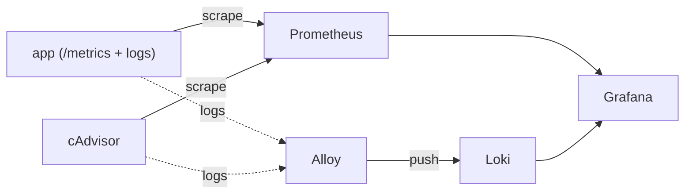

# TP9 — Observabilité : métriques, logs et tableaux de bord

> Durée estimée : 1 h 15 · Ports utilisés : `8088` (appli), `9090` (Prometheus), `8080` (cAdvisor), `3100` (Loki), `3000` (Grafana)
> Prérequis : TP5/TP6 (Compose). Machine avec ~4 Go de RAM libres recommandés.

## 🎬 Le contexte

« Le site est lent », signale un utilisateur. Sans observabilité, vous êtes aveugle : combien de requêtes ? quel conteneur consomme le CPU ? y a-t-il des erreurs dans les logs ? Vous allez monter la **boîte à outils standard** de l'observabilité d'une stack conteneurisée :

- **Métriques** : **Prometheus** collecte des chiffres (requêtes/s, CPU, RAM) auprès de votre **appli** (qui les expose) et de **cAdvisor** (qui mesure tous les conteneurs).
- **Logs** : **Alloy** récupère les logs de tous les conteneurs et les envoie à **Loki**, qui les indexe.
- **Visualisation** : **Grafana** branche Prometheus **et** Loki, pour tout voir au même endroit.

Cas réel : on instrumente un service pour pouvoir **diagnostiquer un incident** en quelques clics plutôt qu'en SSH paniqué sur dix serveurs.

## 🎯 Objectif vérifiable

Une stack où Prometheus affiche les cibles **app** et **cadvisor** en **UP**, où la métrique applicative `telescope_requests_total` est interrogeable, où Grafana est **provisionné** avec les sources **Prometheus** et **Loki**, et où les **logs** des conteneurs arrivent bien dans Loki. `./verify.sh` contrôle tout cela.

---

## L'architecture



## Étape 1 — Démarrer la stack et explorer

```bash
cd starter
docker compose up -d --build
docker compose ps          # 6 services : app, prometheus, cadvisor, loki, alloy, grafana
```

Ouvrez les interfaces :

- **Prometheus** : http://localhost:9090 → menu *Status > Target health*
- **cAdvisor** : http://localhost:8080
- **Grafana** : http://localhost:3000 (admin / admin)
- **Appli** : http://localhost:8088 et http://localhost:8088/metrics

> ❓ **Question** : dans Prometheus (*Target health*), combien de cibles sont **UP** au départ ? Pourquoi seulement `prometheus` lui-même ? (Indice : regardez `starter/prometheus/prometheus.yml`.)

## Étape 2 — Faire scraper l'appli et cAdvisor

Éditez `starter/prometheus/prometheus.yml` et complétez les deux **TODO** : un job `cadvisor` (cible `cadvisor:8080`) et un job `telescope-app` (cible `app:3000`, `metrics_path: /metrics`).

Rechargez la configuration **sans redémarrer** Prometheus (on a activé `--web.enable-lifecycle`) :

```bash
curl -X POST http://localhost:9090/-/reload
```

Générez du trafic, puis interrogez une métrique dans Prometheus (champ *Expression*) :

```bash
for i in $(seq 1 10); do curl -s http://localhost:8088/ >/dev/null; done
```

- `up` → l'état (1/0) de chaque cible
- `telescope_requests_total` → le compteur de votre appli (il monte !)
- `rate(container_cpu_usage_seconds_total[1m])` → le CPU par conteneur (via cAdvisor)

> ❓ **Question** : quelle est la différence entre une métrique de type **counter** (`telescope_requests_total`) et **gauge** (`telescope_uptime_seconds`) ? Pourquoi utilise-t-on `rate()` sur un counter ?

## Étape 3 — Brancher les logs (Loki)

Éditez `starter/grafana/provisioning/datasources/datasources.yml` et complétez le **TODO** : ajoutez la source **Loki** (`type: loki`, `url: http://loki:3100`). Appliquez :

```bash
docker compose restart grafana
```

Dans Grafana, ouvrez **Explore** (boussole), choisissez la source **Loki**, et lancez une requête LogQL :

```logql
{container=~".+"} | json
```

> ❓ **Question** : qui a mis ces logs dans Loki ? Vous n'avez configuré aucun agent dans vos conteneurs applicatifs. (Indice : `solution/alloy/config.alloy` — Alloy lit le **socket Docker**.)

## Étape 4 — Construire un mini-tableau de bord

Dans Grafana : **Dashboards > New > New dashboard > Add visualization**, source **Prometheus**, requête `telescope_requests_total`. Ajoutez un 2ᵉ panneau avec la source **Loki** et `{container=~".+"}`.

> 🧠 Vous venez de réunir **métriques** et **logs** dans une même vue : c'est exactement ce qu'on regarde en premier pendant un incident.

## Étape 5 — Validez, puis démontez

```bash
cd ..
./verify.sh
```

```bash
cd starter && docker compose down -v
```

---

## 💡 Indices

<details>
<summary>Les deux jobs Prometheus à ajouter</summary>

```yaml
  - job_name: cadvisor
    static_configs:
      - targets: ["cadvisor:8080"]

  - job_name: telescope-app
    metrics_path: /metrics
    static_configs:
      - targets: ["app:3000"]
```
</details>

<details>
<summary>La source de données Loki</summary>

```yaml
  - name: Loki
    type: loki
    access: proxy
    url: http://loki:3100
```
</details>

---

## 📖 Où chercher (documentation officielle)

- **Prometheus — configuration & PromQL** : https://prometheus.io/docs/prometheus/latest/configuration/configuration/ · https://prometheus.io/docs/prometheus/latest/querying/basics/
- **cAdvisor** : https://github.com/google/cadvisor
- **Grafana — provisioning des sources de données** : https://grafana.com/docs/grafana/latest/administration/provisioning/#data-sources
- **Loki & LogQL** : https://grafana.com/docs/loki/latest/query/
- **Grafana Alloy (collecteur de logs)** : https://grafana.com/docs/alloy/latest/ — composants [`loki.source.docker`](https://grafana.com/docs/alloy/latest/reference/components/loki/loki.source.docker/)
- **Exposition de métriques (formats & clients)** : https://prometheus.io/docs/instrumenting/exposition_formats/

> 💡 Le format `/metrics` est juste du **texte** : `nom_metrique{label="x"} valeur`. N'importe quel service peut l'exposer ; en prod on utilise une bibliothèque client (`prom-client` en Node, `client_golang` en Go) plutôt que de l'écrire à la main comme dans l'appli de démo.

---

## 🚀 Pour aller plus loin

1. **Alerting.** Ajoutez une règle Prometheus qui déclenche si `up{job="telescope-app"} == 0` pendant 1 min. Comment Alertmanager route-t-il ensuite l'alerte (mail, Slack) ?
2. **Node exporter.** Ajoutez `prom/node-exporter` pour les métriques de l'**hôte** (CPU/RAM/disque de la machine, pas seulement des conteneurs). Quelle différence avec cAdvisor ?
3. **Dashboard as code.** Provisionnez un **dashboard** Grafana via un fichier JSON (comme on a provisionné les sources). Pourquoi est-ce préférable à le cliquer à la main ?
4. **LogQL avancé.** Filtrez les logs sur `level="info"`, puis comptez les requêtes par minute avec `count_over_time({container=~".+"}[1m])`. Reliez un pic de logs à un pic de métrique.
5. **Rétention.** Loki et Prometheus gardent les données un certain temps. Cherchez comment configurer la **rétention** et le stockage objet (S3) pour une vraie prod.
6. **OpenTelemetry.** Découvrez comment OTel unifie métriques, logs **et traces**. Quelle serait la 3ᵉ brique (tracing) à ajouter à cette stack (ex. Tempo) ?
